<div align="center">
  
# ⚡️ ILYES | CODE ARCHITECT ⚡️

[](https://github.com/Ily-es01)


```
⋆｡ﾟ☁︎｡⋆｡ ﾟ☾ ﾟ｡⋆
  Créateur de mondes numériques où
  l'art et le code fusionnent pour former
  des expériences uniques
⋆｡ﾟ☁︎｡⋆｡ ﾟ☾ ﾟ｡⋆
```

</div>

## 📊 MES STATISTIQUES GITHUB

<div align="center">
  <a href="https://github.com/Ily-es01">
    
    
  </a>
  
  
</div>

## ✨ CODEX PERSONALIS

```
                     ▄▄                         ▄▄                     
  ▀████▄     ▄████▀ ▀███                       ████                    
    ████    ████     ██                        ▀▀▀                     
    █ ██   ▄█ ██     ██      ▄██▀██▄  ▄▄█▀██  ████  ▄██▀███  ▄▄█▀██▄   
    █  ██  █▀ ██     ██     ██▀   ▀██▄█▀   ██  ██  ██    ██ ██▀   ▀██  
    █  ██▄█▀  ██     ██     ██     █████▄▄▄▄▄  ██  ▀█████▀  ██     ██  
    █  ▀██▀   ██     ██     ██▄   ▄████       ▄██▄ ██   █   ██▄   ▄██  
    █   ▀▀    ██    ▄████▄   ▀█████▀ ▀████▀   ▀███▀▀████▀    ▀█████▀   
   ▄█▄       ▄██▄                                                      
```

## 🧠 PHILOSOPHIE DE CODE

<div align="center">
  
> 🌈 Explorateur d'idées nouvelles  
> 🔮 Créateur de solutions élégantes  
> 🎧 Développeur rythmé par la passion
>
> *"Le code est comme une blague - s'il doit être expliqué, il n'est probablement pas bon."*

</div>

## 💻 ARSENAL TECHNOLOGIQUE

<div align="center">
  <table>
    <tr>
      <td align="center" width="96">
        
        <br>HTML
      </td>
      <td align="center" width="96">
        
        <br>CSS
      </td>
      <td align="center" width="96">
        
        <br>JavaScript
      </td>
      <td align="center" width="96">
        
        <br>React
      </td>
      <td align="center" width="96">
        
        <br>PHP
      </td>
      <td align="center" width="96">
        
        <br>Laravel
      </td>
    </tr>
    <tr>
      <td align="center" width="96">
        
        <br>Java
      </td>
      <td align="center" width="96">
        
        <br>C
      </td>
      <td align="center" width="96">
        
        <br>C++
      </td>
      <td align="center" width="96">
        
        <br>C#
      </td>
      <td align="center" width="96">
        
        <br>MySQL
      </td>
      <td align="center" width="96">
        
        <br>.NET
      </td>
    </tr>
  </table>
</div>

## 🌟 PROGRESSION TECHNIQUE

<div align="center">
  
  
  
  
  
  
  
  
  
  
  
</div>

## ⋆˚✿˖° PROJETS ÉPIQUES °˖✿˚⋆

<table>
  <tr>
    <td width="50%">
      <h3>🌸 Projet Sakura</h3>
      
      <p>Une application web qui transforme vos idées en univers onirique</p>
      <a href="https://github.com/Ily-es01/sakura">👁️ Explorer</a>
    </td>
    <td width="50%">
      <h3>⚡ Neo Pulse</h3>
      
      <p>Visualisateur musical inspiré de l'esthétique cyberpunk</p>
      <a href="https://github.com/Ily-es01/neopulse">👁️ Explorer</a>
    </td>
  </tr>
</table>

## 🌐 TRAJECTOIRE PROFESSIONNELLE

```mermaid
timeline
    title Ma trajectoire de développeur
    2022 : Début d'apprentissage HTML/CSS/JS
         : Premiers projets frontend
    2023 : Exploration PHP & Laravel
         : Étude de Java et bases de données
    2024 : Approfondissement React
         : Développement de projets full stack
    2025 : Maîtrise des technologies .NET
         : Construction d'applications complexes
```



## 📈 ACTIVITÉ GITHUB

<div align="center">
  
  
  
  
</div>

## 📬 CONNEXION QUANTIQUE

<div align="center">
  
  [](https://github.com/Ily-es01)
  [](https://linkedin.com/in/Ily-es01)
  [](https://twitter.com/Ily-es01)
  [](https://Ily-es01.com)
  
  ```
  ┊   ┊     ┊    ┊    ┊   ┊
  ┊   ┊     ┊    ┊    ┊   ┊  
  ┊   ┊     ┊    ┊    ┊   ┊    ┊
  ┊   ┊     ┊    ┊    ┊   ┊    ┊
  ┊   ┊┊  ┊ ┊    ┊    ┊   ┊    ┊
  ┏━━━┛┛┗━━┛┗━━━━┻━━━┻━━━┻━━━━┛
  ```
  
</div>

<!-- Séparateur visuel -->


<!-- Easter egg caché -->
<!--
  🔍 Vous avez trouvé mon easter egg ! 
  Félicitations pour votre attention aux détails.
  Code secret : IlyesDevMaster2025
-->
